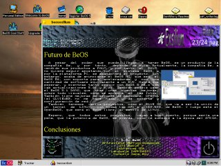
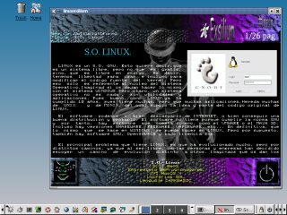
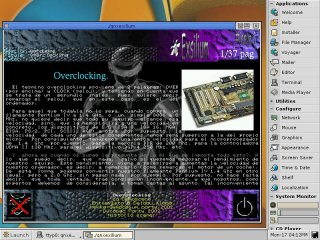

# Diskmag Exilium 1 (April 2002)

Around April 2002, our Sliders group published Diskmag Exilium issue 1 on our own FTP. 
Subsequently, several members of the demoscene published it on <b>pouet.net</b> and <b>scene.org</b>.

<ul>
 <li><a href='https://www.pouet.net/prod.php?which=5967'>https://www.pouet.net/prod.php?which=5967</a></li>   
</ul>  

Feature articles:
<ul>
 <li>Interview with the scenery group Delabu Alama.</li>
 <li>Interview with Fernando Lopez (beprogramadores.org)</li>
 <li>Overclocking</li>
 <li>Programming with SDL</li>
 <li>COVOX sound</li> 
</ul>

This diskmag was multiplatform (DOS, Windows, Linux, Beos and QNX). It had several other engines, like BSD and PSX, but in the end, it was released for those 5. 
The editor and coder of it is me (JJ, ackerman). 

After so many years, I am releasing the code, so that it can be looked at in an educational way or whatever you want, given that it is of little use today. 

If you just want to run, the data (sliders1.dat) was in the MSDOS distribution, having to copy the binaries for each OS to the same location.
