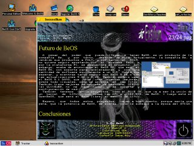
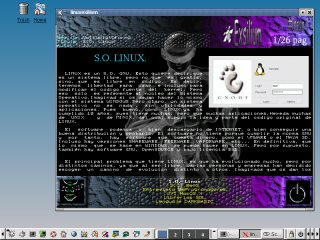
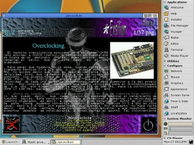
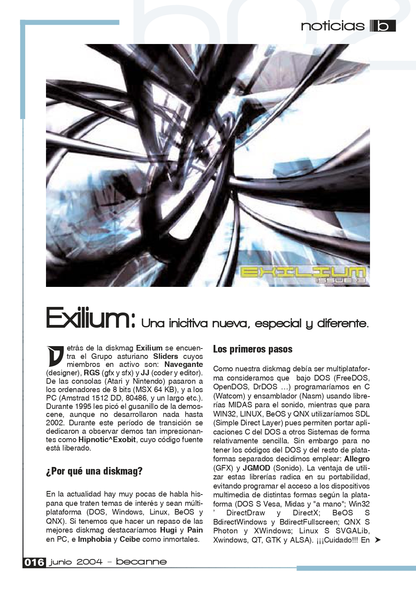
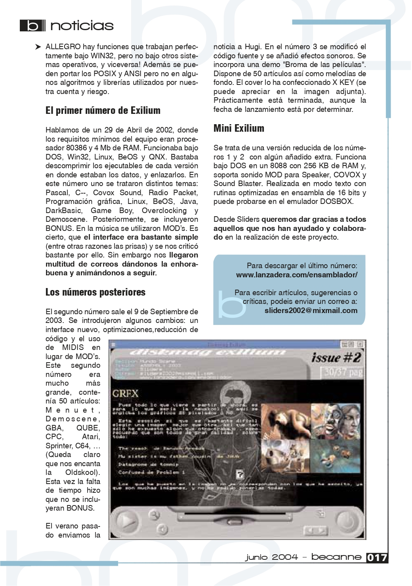

# Diskmag Exilium 1 (Abril 2002)

Aproximádamente, en Abril del 2002 nuestro grupo <b>Sliders</b> publicó el número 1 de la Diskmag Exilium en nuestro propio FTP. 
Posteriormente, varios miembros de la demoscene, lo publicaron en <b>pouet.net</b> y <b>scene.org</b>.

<ul>
 <li><a href='https://www.pouet.net/prod.php?which=5967'>https://www.pouet.net/prod.php?which=5967</a></li>   
 <li><a href='https://files.scene.org/view/mirrors/scenesp.org/diskmags/exilium%231.zip'>https://files.scene.org/view/mirrors/scenesp.org/diskmags/exilium%231.zip</a>
</ul>  

Artículos a destacar:
<ul>
 <li>Entrevista al grupo scener Delabu Alama</li>
 <li>Entrevista a Fernando Lopez (beprogramadores.org)</li>
 <li>Overclocking</li>
 <li>Programar con SDL</li>
 <li>COVOX sound</li> 
</ul>

Dicha diskmag fue multiplataforma (DOS, Windows, Linux, Beos y QNX). Tenía varios motores más, como BSD y PSX, pero al final, salió para esos 5. 
El editor y coder de la misma soy yo (JJ, ackerman). 

Después de tantos años, libero el código, para que se mire de manera educativa o lo que se quiera, dado que a día actual, tiene muy poca utilidad. 

Si sólo se quiere ejecutar, los datos (sliders1.dat) estaban en la distribución de MSDOS, teniendo que copiar los binarios de cada Sistema Operativo en su misma ubicación. 

En el número 2 de la revista Becanne de Centolos nos dedican un artículo:

